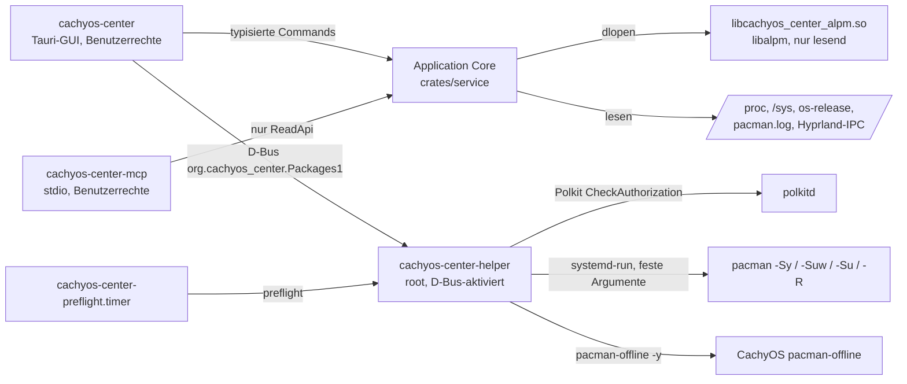
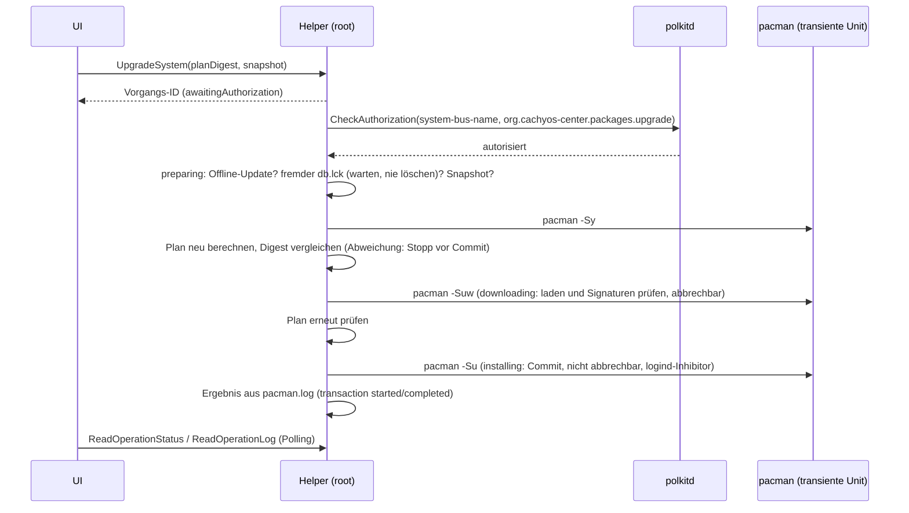

# Architektur

cachyos-center besteht aus drei Programmen und einer zur Laufzeit geladenen Bibliothek. Die
Fachlogik liegt in Rust-Crates, die Oberfläche in React/TypeScript. Paketänderungen erfolgen
ausschließlich im privilegierten Helper über pacman.

## Prozesse und Grenzen

| Programm | Rechte | Aufgabe |
|---|---|---|
| `cachyos-center` | Benutzer | Oberfläche, Lesezugriffe über den Application Core, startet Vorgänge beim Helper |
| `cachyos-center-helper` | root (D-Bus-aktivierter Systemdienst) | geschlossene Liste von Paketoperationen, Auto-Update-Policy, Preflight des Timers |
| `cachyos-center-mcp` | Benutzer (vom MCP-Host gestartet) | lokaler, rein lesender MCP-Server über stdio; kann den Helper nicht erreichen |
| `libcachyos_center_alpm.so` | im jeweiligen Prozess | einzige Stelle, die libalpm einbindet; wird per `dlopen` geladen |

## Crates

| Crate | Inhalt |
|---|---|
| `crates/core` | Modelle, stabile Fehlercodes, Zustandsmaschine der Vorgänge, Validierung, Plan-Digest, Sanitizer, D-Bus-/Polkit-Namen, Protokoll der libalpm-Bridge; erzeugt die TypeScript-Typen (`ts-rs`) |
| `crates/alpm-bridge` | `cdylib` mit C-ABI (`cc_alpm_bridge_call`), JSON-Anfragen; installierte Pakete, Repository-Suche, Details, Transaktionspläne mit `ALPM_TRANS_FLAG_NOLOCK` |
| `crates/packages` | Lader der Bridge, pacman-Konfiguration über `pacman-conf`, isolierte Updateprüfung mit `checkupdates`, pacman.log-Parser, Lock-Status |
| `crates/system` | Systeminformationen, Hyprland-IPC, Gesundheitsprüfungen, Snapshot-Erkennung, News (RSS), Erkennung von `pacman-offline` und anderen Updatern |
| `crates/service` | Application Core: `AppCore` implementiert `ReadApi` für GUI und MCP; Einstellungen, SQLite-Verlauf, Aktivität, Gesundheitsbericht, Diagnosebericht |
| `crates/helper` | privilegierter Helper: D-Bus-Schnittstelle, Polkit, Vorgangs-Engine, Journal, Wiederherstellung, Auto-Update-Policy, Preflight |
| `crates/mcp` | MCP-Server mit sechs Lese-Tools (`rmcp`, stdio) |
| `apps/desktop/src-tauri` | Tauri-2-Backend: Commands, Helper-Client, Hintergrundaufgaben, Benachrichtigungen |
| `apps/desktop/src` | React-Oberfläche (Vite, TypeScript, Radix-Primitive) |

## Warum eine zur Laufzeit geladene libalpm-Bridge?

Das `alpm`-Binding zielt auf genau eine libalpm-Hauptversion (hier 16). Würden die Programme
libalpm direkt linken, könnten sie nach einem pacman-Update mit neuem Soname nicht mehr starten –
ohne verständliche Meldung. Deshalb linkt nur `libcachyos_center_alpm.so` libalpm. Die Programme
laden sie mit `dlopen`:

- Fehlt `libalpm.so.16` oder passt die Protokollversion nicht, liefern alle Paketfunktionen den
  Fehler `UNSUPPORTED` mit Erklärung; Systeminformationen, Einstellungen und MCP-Systemdaten
  funktionieren weiter.
- Beim Build prüft das `alpm`-Crate die libalpm-Version (`checkver`), zur Laufzeit prüft die Bridge
  die Hauptversion der geladenen Bibliothek.
- Das Arch-Paket hängt deshalb nicht von einem versionierten Soname ab und blockiert kein
  pacman-Update.

Die Bridge ist rein lesend: Sie erneuert keine Datenbank, nimmt nie den Datenbank-Lock und
committet nie eine Transaktion. Pläne werden wie bei `pacman -Sp` ohne Lock berechnet; Rückfragen
beantwortet sie wie `pacman --noconfirm`, damit der Plan dem späteren Lauf des Helpers entspricht.

## Updateprüfung ohne Teil-Upgrade-Zustand

`checkupdates` synchronisiert eine **Kopie** der Sync-Datenbanken in ein eigenes Verzeichnis
(`$XDG_CACHE_HOME/cachyos-center/checkup-db`, beim Timer `/var/lib/cachyos-center/checkup-db`).
Die produktive Datenbank bleibt unberührt, es entsteht kein `pacman -Sy` ohne `-u`. Die Bridge
wertet die isolierte Datenbank gegen die aktuelle lokale Datenbank aus und berechnet den
vollständigen Upgrade-Plan. Das Ergebnis trägt immer Zeitpunkt und Status (`neverChecked`,
`fresh`, `stale`, `failed`, `prerequisiteMissing`, `unsupported`); „0 Updates“ wird nur bei einer
frischen, erfolgreichen Prüfung angezeigt.

## Transaktionsablauf im Helper

- **Vollständige Transaktion:** Die drei Phasen ergeben zusammen `pacman -Syu`; die Commit-Phase
  ist immer `-Su` über alle Pakete, nie ein Teil-Upgrade. Installation: `-Su --needed repo/pkg`.
- **Plan-Digest:** SHA-256 über die sortierten Einträge (Aktion, Repository, Name, alte und neue
  Version). Jede Abweichung gilt als wesentlich: Der Vorgang endet mit `cancelledBeforeCommit`,
  `PLAN_CHANGED` und dem tatsächlichen Plan; die Oberfläche fordert eine erneute Bestätigung.
- **Transiente Units:** Jeder pacman-Schritt läuft über `systemd-run --wait` in einer eigenen Unit.
  Stürzt der Helper ab oder wird er neu gestartet, läuft pacman weiter; beim Start rekonstruiert
  der Helper den Zustand aus Journal und pacman.log.
- **Ergebnis mit Nachweis:** Erfolg nur, wenn pacman.log `transaction completed` enthält. Ohne
  Nachweis endet ein begonnener Commit mit `needsAttention` („Ergebnis unbekannt“).

## Zustandsmaschine

`Idle → Checking → Ready → AwaitingAuthorization → Preparing → Downloading → Installing →
Succeeded | Failed | NeedsAttention`, Abbruch nur bis einschließlich `Downloading`
(`CancelledBeforeCommit`). Ungültige Übergänge lehnt `Operation::transition` ab (Tests in
`crates/core/src/operation.rs`).

## Persistenz

| Ort | Inhalt | Rechte |
|---|---|---|
| `$XDG_CONFIG_HOME/cachyos-center/settings.toml` | Einstellungen | 0600 |
| `$XDG_DATA_HOME/cachyos-center/history.sqlite3` | Verlauf der App-Vorgänge (SQLite, WAL) | Benutzer |
| `$XDG_CACHE_HOME/cachyos-center/` | isolierte Prüfdatenbank, Prüfstatus, News-Cache | Benutzer |
| `$XDG_STATE_HOME/cachyos-center/` | gelesene News, zuletzt gemeldeter Timer-Lauf | Benutzer |
| `/etc/cachyos-center/auto-update.toml` | Auto-Update-Policy (nur Helper schreibt) | 0644 root |
| `/etc/cachyos-center/experimental.toml` | Freischaltung von Funktionen in Entwicklung (nur Administrator) | root |
| `/var/lib/cachyos-center/operations/` | Journal der Helper-Vorgänge (JSON, ohne Pfade) | 0644 root; Wiederherstellungsdaten 0600 |
| `/var/log/cachyos-center/<id>.log` | pacman-Ausgabe je Vorgang | root |

Paketlisten werden nicht dupliziert, sondern immer aus dem System gelesen.

## Oberfläche

React 19 mit TypeScript; die Datentypen stammen aus `apps/desktop/src/bindings` (aus Rust
erzeugt, CI prüft Aktualität). Tauri-Capabilities erlauben genau die Commands aus dem
[IPC-Vertrag](ipc-vertrag.md) und das Empfangen von Events; es gibt kein Shell-, Dateisystem- oder
Prozessrecht im Webview und eine Content Security Policy ohne fremde Quellen.
